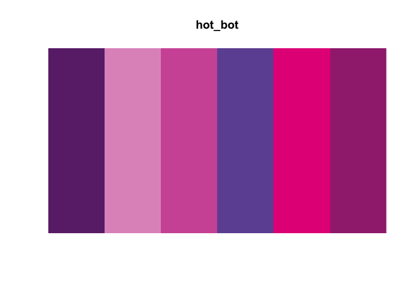
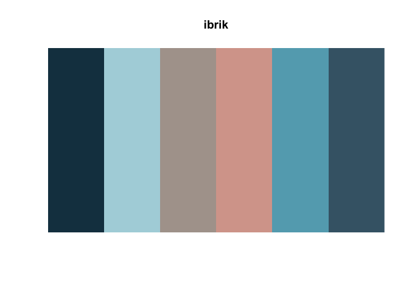

# technocolor

The technocolor package contains colour palettes based on the album
artwork some of my favourite electronic music records. The name
“technocolour” is a slight misnomer since they’re not all techno records
- apologies.

## Installation

``` r
devtools::install_github("sophiemeakin/technocolour")
```

## Usage

The `technocolours()` function makes a discrete colour palette based on
your chosen track, specified with `name = "track_name"`. The option `n`
allows you to specify the number of colours in the palette, which is 6
by default.

## Palettes

``` r
print_palette(name = "esther")
```


``` r
print_palette(name = "fluorescent_rush")
```


``` r
print_palette(name = "glue")
```


``` r
print_palette(name = "hot_bot")
```



``` r
print_palette(name = "ibrik")
```



``` r
print_palette(name = "poodle_power")
```


## Palette info

The function `info()` prints the name of the track, artist and a URL to
the song.

``` r
info("fluorescent_rush")
```

    ## Track name:  One More Flourescent Rush 
    ##     Artist:  Avalon Emerson 
    ##        URL:  https://avalonemerson.bandcamp.com/track/one-more-fluorescent-rush
