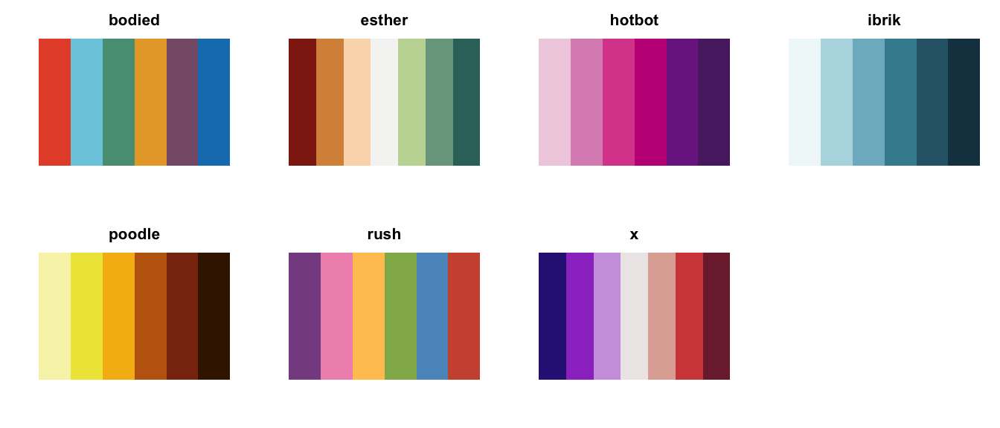

# technocolour: colour palettes based on electronic music records

The `technocolour` package contains colour palettes based on the album
artwork some of my favourite electronic music records. Enjoy!

## Installation

You can install the package from Github:

``` r
devtools::install_github("sophiemeakin/technocolour")
```

## Available palettes



## Quick-start guide

### List available palettes

List the names of all available palettes with `list_palettes()`; you can
specify the type of palette (qualitative, sequential, or diverging) with
the argument `type`:

``` r
list_palettes()
```

    ## [1] "bodied" "esther" "hotbot" "ibrik"  "poodle" "rush"   "x"

### Visualise palettes

Preview a named palette with `print_palette()`:

``` r
print_palette(name = "esther")
```


### Using with ggplot2

Use `scale_color_techno()` and `scale_fill_techno()` to use the palette
in ggplot object:

``` r
ggplot(data = iris,
       aes(x = Petal.Length, y = Petal.Width, col = Species)) +
  geom_point(size = 3) +
  scale_color_techno(name = "rush") +
  theme_bw() +
  theme(legend.position = "top",
        text = element_text(size = 14))
```


### Palette info

Print the track name, artist name and URL link for a named palette with
`info()`:

``` r
info("poodle")
```

    ##      Artist:  Avalon Emerson 
    ##      Record:  DJ-Kicks EP 
    ##  Track name:  Poodle Power 
    ##         URL:  https://avalonemerson.bandcamp.com/track/poodle-power

Please read the [package
documentation](https://sophiemeakin.github.io/technocolour/reference/index.html)
for full details of how to use package.

## Contributing

Please add new palettes based on your favourite records! Contributing
guide coming soon! 👀
