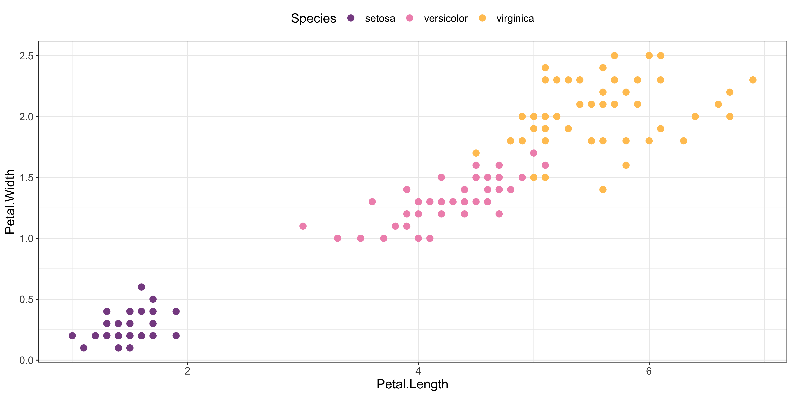

# technocolour: colour palettes based on electronic music records

The `technocolour` package contains colour palettes based on the album
artwork some of my favourite electronic music records. Enjoy!

## Installation

``` r
devtools::install_github("sophiemeakin/technocolour")
```

## Usage

The `technocolours()` function makes discrete and continuous colour
palettes based on electronic music records, specified with
`name = "track_name"`.

### Examples

``` r
ggplot(data = iris,
       aes(x = Petal.Length, y = Petal.Width, col = Species)) +
  geom_point(size = 3) +
  scale_color_techno(name = "rush") +
  theme_bw() +
  theme(legend.position = "top",
        text = element_text(size = 14))
```



### Availble palettes

List the names of all available palettes with `list_palettes()`:

``` r
list_palettes()
```

    ## [1] "bodied" "esther" "glue"   "hotbot" "ibrik"  "poodle" "rush"

### Visualise palettes

Visualise a named palette with `print_palette()`:

``` r
print_palette(name = "bodied")
```


``` r
print_palette(name = "esther")
```


``` r
print_palette(name = "glue")
```


``` r
print_palette(name = "hotbot")
```


``` r
print_palette(name = "ibrik")
```


``` r
print_palette(name = "poodle")
```


``` r
print_palette(name = "rush")
```


### Palette info

Print the track name, artist name and URL link for a named palette with
`info()`:

``` r
info("rush")
```

    ##      Artist:  Avalon Emerson 
    ##      Record:  Whities 013 
    ##  Track name:  One More Fluorescent Rush 
    ##         URL:  https://avalonemerson.bandcamp.com/track/one-more-fluorescent-rush

## Contributing

Please add new palettes based on your favourite records! Contributing
guide coming soon! 👀
